 

 

  
  
  

 

## 🧠 About Me

- 🚀 Backend Developer focused on building **secure, scalable REST APIs** with Java and Spring Boot
- 🏗️ I enjoy designing clean, **layered architectures** that are easy to maintain and extend
- 🔐 Comfortable working with authentication & authorization flows (Spring Security, JWT)
- 📚 Actively sharpening my **Data Structures & Algorithms** skills through consistent practice
- 🌱 Currently deepening my knowledge of distributed systems, caching, and API design patterns
- ⚡ Fun fact: I like taking real-world platforms (Airbnb, ordering systems) and rebuilding their backend logic from scratch to really understand how they work

 

## 🛠️ Tech Stack

### Languages & Core

### Frameworks & Libraries

### Databases & Caching

### Tools & Platforms

 

## 🚀 Featured Projects

<table>
<tr>
<td width="50%">

### 🏠 [Airbnb Backend Clone](https://github.com/rishit1711/airBnb---Backend)
Scalable backend replicating Airbnb's core booking engine — inventory management, dynamic pricing logic, and secure user flows.

`Java` `Spring Boot` `Spring Security` `JWT` `PostgreSQL`

</td>
<td width="50%">

### 🚦 [Redis-Powered Rate Limiter](https://github.com/rishit1711/RateLimiterProject)
A production-inspired rate limiter protecting APIs from traffic spikes and abuse — implements both **Fixed Window** and **Token Bucket** algorithms with Redis atomic counters and TTL-based expiration.

`Java` `Spring Boot` `Redis` `Docker` `System Design`

</td>
</tr>
</table>

 

### 🧪 Currently Building

<table>
<tr>
<td width="50%">

### ✨ [AI Workspace Platform](https://github.com/rishit1711/ai-workspace-platform) `🚧 In Development`
A prompt-to-frontend generation platform (Lovable-style) — users describe what they want in plain language, and the platform generates a working **React** frontend for them. Powered by **Spring AI** on the backend to orchestrate LLM-driven code generation.

`Java` `Spring Boot` `Spring AI` `React` `LLM Integration`

> 🔨 Actively in progress — architecture and core generation pipeline underway.

</td>
<td width="50%">

### 🎯 [PrepPilot AI](https://github.com/rishit1711/PrepPilotAI) `🚧 In Development`
An adaptive AI interview intelligence platform that simulates realistic technical interviews — analyzing resumes and job descriptions via RAG, verifying resume claims, and delivering evidence-based, explainable feedback with a personalized learning roadmap.

`Spring Boot` `Spring Security` `Spring AI / LangChain4j` `PostgreSQL` `Qdrant` `Gemini API`

> 🔨 Actively in progress — building out the adaptive interview engine and knowledge vault.

</td>
</tr>
</table>

 

## 📊 GitHub Stats

  
  

  

  

 

## 📈 Contribution Graph

  

 

## 🤝 Let's Connect

I'm always up for a conversation about backend engineering, system design, or interesting problems to solve. Feel free to reach out!

 

  

